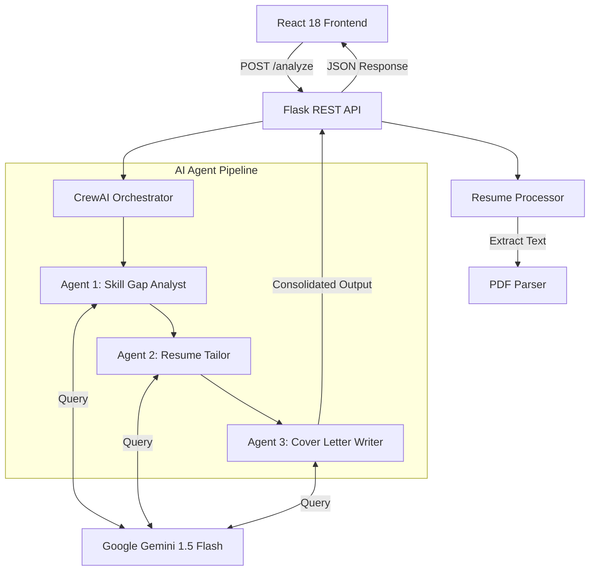

# 🚀 SmartApply AI
### Land your dream job with AI-powered resume optimization in 60 seconds.


---

## 🏛️ Project Vision
**SmartApply AI** is an enterprise-grade recruiting intelligence tool that bridges the gap between high-potential candidates and robotic applicant tracking systems. By leveraging the **Google Gemini 1.5 Flash** large language model through a sophisticated multi-agent orchestration layer, it turns generic resumes into highly-targeted personal branding assets.

## 💡 The Problem
Job seekers often spend **hours** manually tailoring their resumes for every application. Even then, **75% of qualified resumes** are rejected by ATS systems before they reach a human recruiter due to missing keywords or poor formatting.

## ✨ The Solution
Our 3-agent intelligence pipeline automates the entire tailoring process:
- **Semantic Gap Analysis**: Identifies missing skills and industry keywords.
- **Resume Optimization**: Rewrites professional summaries and achievements with 100% truthfulness.
- **Compelling Narrative**: Crafts personalized, high-conversion cover letters.

---

## 🏗️ System Architecture

SmartApply AI utilizes a high-performance, decoupled architecture to handle multi-agent long-running processes efficiently.



---

## 🤖 Deep-Dive: AI Agent Pipeline

The intelligence layer is powered by **CrewAI**, orchestrating three distinct agents in a sequential task workflow:

| Agent | Role | Responsibility |
| :--- | :--- | :--- |
| **Career Analyst** | 🧠 Intelligence | Performs semantic analysis of Job Description vs. Resume. Calculates match percentage. |
| **Resume Strategist** | 🖋️ Optimization | Rewrites professional summaries and bullet points using targeted industry lexicon. |
| **Copy Specialist** | ✉️ Persuasion | Crafts personalized, 3-paragraph cover letters with unique hooks and professional tone. |

---

## 🛠️ Technology Stack

### **Frontend Architecture**
- **Framework**: `React 18` + `Vite` for ultra-fast development and optimized builds.
- **Styling Engine**: `Tailwind CSS` for a bespoke, premium dark-themed UI.
- **Animation System**: `Framer Motion` for sophisticated micro-interactions and transitions.
- **Utilities**: `Axios` (API Calls), `React Dropzone` (PDF Processing), `React Router DOM`.

### **Backend Infrastructure**
- **API Server**: `Python Flask` providing a robust RESTful API.
- **Orchestration**: `CrewAI` for autonomous multi-agent task management.
- **Large Language Model**: `Google Gemini 1.5 Flash` for industrial-strength reasoning.
- **PDF Engine**: `PyPDF2` for accurate, high-speed text extraction.

---

## 🚀 Installation & Deployment

### **Prerequisites**
- **Python**: v3.12 or newer
- **Node.js**: v18 or newer
- **Google AI Studio Key**: Required for Gemini LLM access

### **1. Local Environment Setup**
```bash
# Clone the repository
git clone https://github.com/hyndhavamahesh345/SmartApply-AI.git
cd smartapply-ai

# Backend Configuration
cd backend
python -m pip install -r requirements.txt

# Create .env file in the root directory
# GEMINI_API_KEY=your_key_here
```

### **2. Running the System**
```bash
# Start Backend (Port 5000)
cd backend
python app.py

# Start Frontend (Port 5173)
cd frontend
npm install
npm run dev
```

---

## 📈 System Roadmap
- [ ] **Multi-Resume Support**: Save and manage different resume versions.
- [ ] **Direct PDF Export**: Export tailored resumes directly to high-quality PDF.
- [ ] **LinkedIn Integration**: Sync skill gaps directly with your profile.
- [ ] **Email Automation**: One-click application via integrated email clients.

## 📝 License & Contact
SmartApply AI is released under the **MIT License**. For enterprise support or custom integration inquiries, please contact the development team through the repository issues page.

---
*Crafted for candidates. Optimized for results.*

