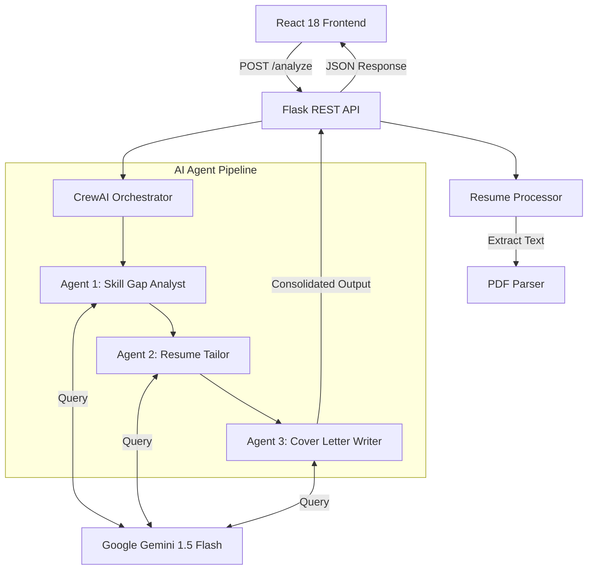

# 🚀 SmartApply AI
### Land your dream job with AI-powered resume optimization in 60 seconds.


---

## 💡 The Problem
Job seekers spend an average of **3 to 4 hours per application** manually tailoring resumes and writing cover letters. Despite this effort, **75% of resumes are rejected by ATS systems** before reaching a human recruiter. Generic applications often fail to highlight the specific keywords and achievements that align with job requirements.

## ✨ The Solution
**SmartApply AI** is an intelligent, multi-agent system designed to bridge the gap between candidate qualifications and recruiter expectations. Powered by **Google Gemini 1.5 Flash** and orchestrated by **CrewAI**, it performs a deep analysis of any job description against your resume, identifies skill gaps, optimizes your professional summary and bullet points, and generates a compelling, personalized cover letter—all in under 60 seconds.

---

## 🛠️ Tech Stack

### Frontend
- **Framework**: [React 18](https://reactjs.org/) with [Vite](https://vitejs.dev/)
- **Styling**: [Tailwind CSS](https://tailwindcss.com/)
- **Animations**: [Framer Motion](https://www.framer.com/motion/)
- **Transitions**: [React Router DOM](https://reactrouter.com/)
- **Media**: [React Dropzone](https://react-dropzone.js.org/) for PDF uploads
- **API Communication**: [Axios](https://axios-http.com/)

### Backend
- **Core**: [Python Flask](https://flask.palletsprojects.com/)
- **AI Orchestration**: [CrewAI](https://www.crewai.com/)
- **Deep Learning Model**: [Google Gemini 1.5 Flash](https://deepmind.google/technologies/gemini/)
- **PDF Processing**: [PyPDF2](https://pypdf2.readthedocs.io/)
- **Environment**: [python-dotenv](https://github.com/theskumar/python-dotenv)

---

## 🏗️ System Architecture

SmartApply AI is built with a decoupled client-server architecture, ensuring high performance and scalability.



### Data Flow Overview
1.  **Frontend**: User uploads a PDF and pastes a job description.
2.  **API Layer**: Flask validates the input and calls the `ResumeProcessor` for text extraction.
3.  **Intelligence Layer**: CrewAI kicks off a sequential process where three specialized agents collaborate, using the shared context of the previous agent's findings.
4.  **LLM Layer**: Each agent communicates with the Gemini-1.5-Flash model to perform complex reasoning and text generation.
5.  **Output**: The final optimized results are returned to the React frontend for real-time visualization.

---

## 🤖 AI Agent Architecture

SmartApply AI employs a **Sequential Pipeline of 3 Specialized Agents**:

1.  **📊 Career Intelligence Analyst (Agent 1)**: Performs a semantic gap analysis, identifies missing industry-standard keywords, and calculates a baseline "Match Percentage."
2.  **🖋️ Professional Resume Strategist (Agent 2)**: Re-writes the resume's professional summary and highlights key achievements, ensuring high ATS compatibility while maintaining 100% truthfulness.
3.  **✉️ Persuasive Communication Specialist (Agent 3)**: Leverages findings from the previous agents to craft a compelling, 3-paragraph cover letter with a unique hook and a confident professional tone.

---

## 🚀 Getting Started

### Prerequisites
- Python 3.12+
- Node.js 18+
- [Google AI Studio API Key](https://aistudio.google.com/)

### Installation

#### 1. Clone the repository
```bash
git clone https://github.com/your-username/smartapply-ai.git
cd smartapply-ai
```

#### 2. Backend Setup
```bash
cd backend
python -m pip install -r requirements.txt
```
Create a `.env` file in the root directory:
```env
GEMINI_API_KEY=your_gemini_api_key_here
```

#### 3. Frontend Setup
```bash
cd frontend
npm install
```

### Running the Application

1.  **Start the Backend**:
    ```bash
    cd backend
    python app.py
    ```
    The API will be available at `http://localhost:5000`.

2.  **Start the Frontend**:
    ```bash
    cd frontend
    npm run dev
    ```
    Open your browser to `http://localhost:5173`.

---

## 📈 Key Features

- **Circular ATS Progress Tracking**: Visualize your score improvement before and after optimization.
- **Skill Gap Heatmap**: Instantly see which core requirements you're currently missing.
- **Micro-Copy Tools**: One-click copy for tailored bullet points and summaries.
- **JSON Export**: Download your complete analysis and generated content for future reference.
- **Premium UX**: Responsive, dark-themed interface with smooth Framer Motion transitions.

---

## 📝 License
Distributed under the MIT License. See `LICENSE` for more information.

---
*Developed with Passion by SmartApply AI Team*
